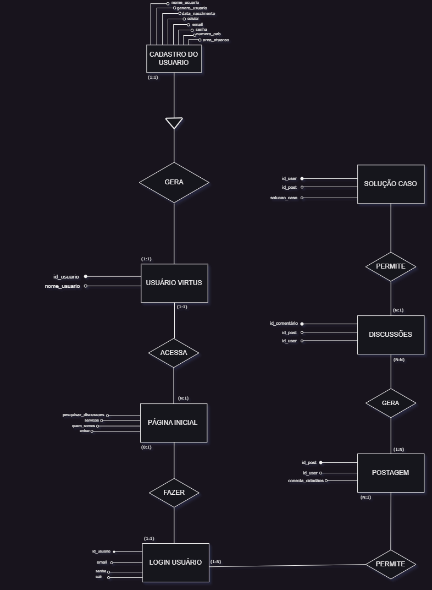
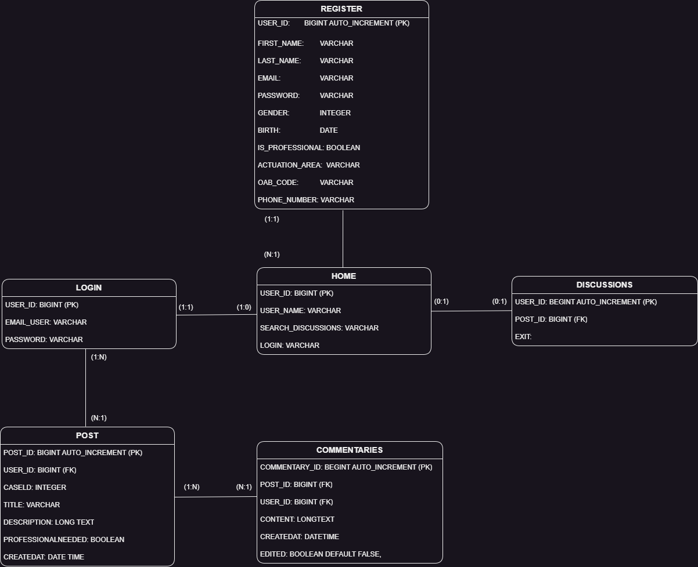
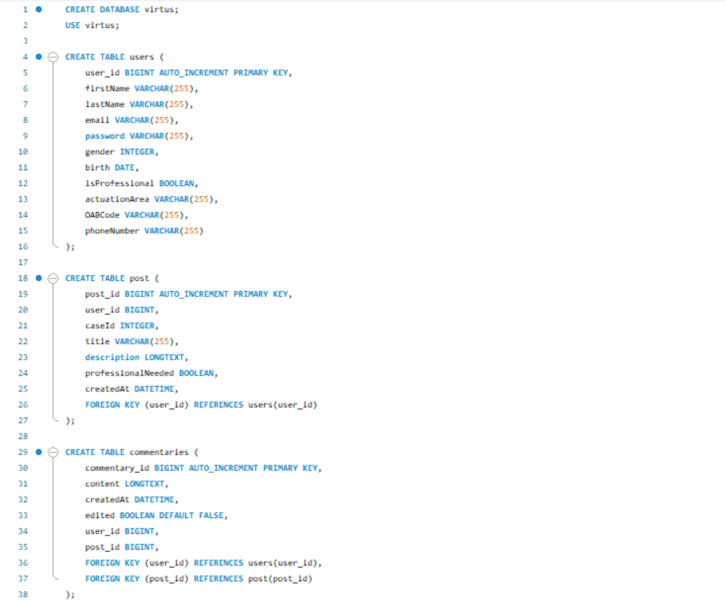

#Banco-de-Dados – Virtus

Todas as informaçãos pessoais foram tratadas de acordo com a lei de n°13.709, tabém conhecida como Lei Geral de Proteção de Dados (LGPD). Baseada em princípios fundamentais, como o respeito à privacidade, a autodeterminação informativa, a transparência, a finalidade, a necessidade, a segurança, a não discriminação e a prestação de contas.

Para começarmos a desenvolver nosso banco de dados, utilizamos o modelo “MER” (Modelo de Entidade e Relacionameto), com ele conseguimos descrever os requesitos que serão necessários para a nossa plataforma. 
A primeira parte da modelagem consiste em fazer o modelo conceitual e assim identificar todas as entidades que serão tabelas implementadas dentro do banco de dados e alguns atributos correspondentes a essas entidades que irão conter algumas informações. Primeiro identificamos que o cadastro gera um Usuário Virtus, seja Cidadão ou Profissional do Direito, e este mesmo usuário é direcionado para a página inicial que pode conter “1” ou “N” usuários. Estando em sua conta pessoal o usuário é permitido fazer “1” ou “N” postagens, que já por sua vez pode gerar “N” discussões o que nos leva a solução do caso

### Modelo Conceitual

### MODELO LÓGICO

Após a modelagem conceitual, fizemos o modelo lógico do nosso banco, com ele identificamos as chaves primárias, chaves estrangeiras e definimos para cada coluna o tipo de dado necessário. 

### Modelo Físico

Por fim, temos nosso modelo físico que consiste em partir do modelo lógico,
descrever as estruturas físicas da armazenamento de dados, tais como: tamanho de campos, índices, tipo de preenchimento destes campos, nomenclaturas, etc, projetadas de acordo com os requisitos de processamento e uso mais econômico dos recursos computacionais.

### Aviso Legal

Este repositório tem fins educacionais e informativos. Certifique-se de respeitar os direitos autorais e as licenças aplicáveis ao utilizar qualquer material encontrado aqui. O autor não assume nenhuma responsabilidade pelo uso indevido das informações contidas neste repositório.

### Referências

#### Livros:
•	Senac – Introdução ao Banco de Dados

•	Senac – Projeto Banco de Dados

•	Banco de Dados: Teoria e Desenvolvimento

•	Database System Concepts

•	SQL Cookbook 

#### Artigos e Documentação: 
•	MongoDB

•	PostgreSQL

•	W3Schools – SQL Tutorial
