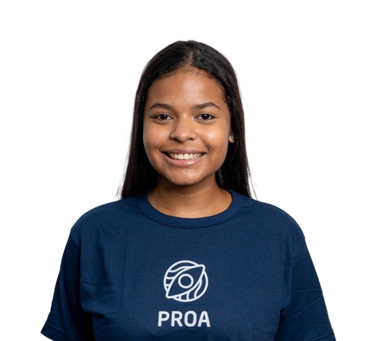
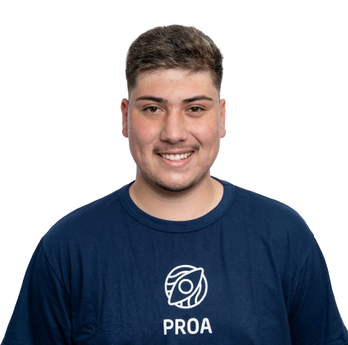

## Conteúdo
- [Integrantes](#integrantes)

## Integrantes

<ul style="display: flex; flex-wrap: wrap; gap: 2rem;">
<!-- Daniel Ribeiro -->
<li style="display: flex; align-items: center; gap: 1rem">
 

  
 

 

  <h4
   style="
    color: #374151;
    font-weight: 600;
    @media (min-width: 640px) {
     font-size: 1.125rem;
     line-height: 1.75rem;
    }
   "
  >
   Daniel Ribeiro
  </h4>
  
Business Analytics

  

   
   
  

 

</li>
<!--  -->
<!-- Eduarda Ribas -->
<li style="display: flex; align-items: center; gap: 1rem">
 

  
 

 

  <h4
   style="
    color: #374151;
    font-weight: 600;
    @media (min-width: 640px) {
     font-size: 1.125rem;
     line-height: 1.75rem;
    }
   "
  >
   Eduarda Ribas
  </h4>
  
Product Owner & Front-end Developer

  

   
   
  

 

</li>
<!--  -->
<!-- Gabriel Pineiro -->
<li style="display: flex; align-items: center; gap: 1rem">
 

  
 

 

  <h4
   style="
    color: #374151;
    font-weight: 600;
    @media (min-width: 640px) {
     font-size: 1.125rem;
     line-height: 1.75rem;
    }
   "
  >
   Gabriel Pinheiro
  </h4>
  
Back-end Developer

  

   
   
  

 

</li>
<!--  -->
<!-- João Victor -->
<li style="display: flex; align-items: center; gap: 1rem">
 

  
 

 

  <h4
   style="
    color: #374151;
    font-weight: 600;
    @media (min-width: 640px) {
     font-size: 1.125rem;
     line-height: 1.75rem;
    }
   "
  >
   João Vitor
  </h4>
  
Financeiro

  

   
   
  

 

</li>
<!--  -->
<!-- Matheus Vieira -->
<li style="display: flex; align-items: center; gap: 1rem">
 

  
 

 

  <h4
   style="
    color: #374151;
    font-weight: 600;
    @media (min-width: 640px) {
     font-size: 1.125rem;
     line-height: 1.75rem;
    }
   "
  >
   Matheus Vieira
  </h4>
  
Full-stack Developer

  

   
   
  

 

</li>
<!--  -->
<!-- Paulo Victor -->
<li style="display: flex; align-items: center; gap: 1rem">
 

  
 

 

  <h4
   style="
    color: #374151;
    font-weight: 600;
    @media (min-width: 640px) {
     font-size: 1.125rem;
     line-height: 1.75rem;
    }
   "
  >
   Paulo Vitor
  </h4>
  
Scrum Master & Back-end Developer

  

   
   
  

 

</li>
<!--  -->
<!-- Rômulo Brito -->
<li style="display: flex; align-items: center; gap: 1rem">
 

  
 

 

  <h4
   style="
    color: #374151;
    font-weight: 600;
    @media (min-width: 640px) {
     font-size: 1.125rem;
     line-height: 1.75rem;
    }
   "
  >
   Rômulo Brito
  </h4>
  
Financeiro

  

   
   
  

 

</li>
<!--  -->

</ul>